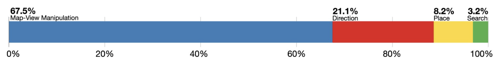
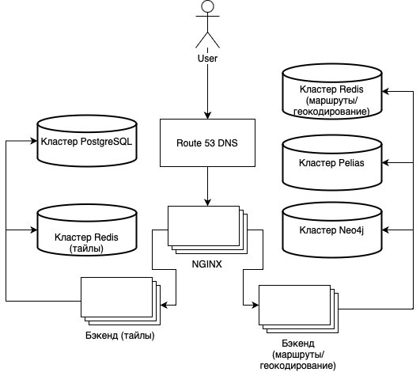

# 1. Тема и целевая аудитория
## 1.1 Тема
[Яндекс.Карты](https://yandex.ru/maps) - это сервис, который позволяет пользователям получать информацию о местоположении, а также о местах, которые находятся поблизости. Сервис предоставляет возможность построения маршрутов, поиска мест, просмотра информации о местах, а также позволяет оставлять отзывы о местах.

## 1.2 Целевая аудитория
В декабре 2022 года количество посетителей сервиса составляет примерно 24 млн. пользователей [^1] каждый месяц. Это около 800 тыс. посетителей в день. Целевая аудитория согласно информации сервиса [^2] относительно страны проживания:
| Страна | Процент посетителей |
| --- | --- |
| 🇷🇺 Россия | 90.08% |
| 🇺🇦 Украина | 2.35% |
| 🇰🇿 Казахстан | 1.75% |
| 🇩🇪 Германия | 1.22% |
| 🇹🇷 Турция | 0.92% |
| 🌐 Другие | 3.68% |

## 1.3 MVP (Minimum Viable Product)
- Поиск организаций, магазинов, банкоматов и других объектов на карте
- Просмотр информации о найденных объектах
- Построение маршрутов
- Просмотр информации о местоположении пользователя
- Просмотр и добавление отзывов о местах
- Просмотр и добавление фотографий мест
- Просмотр и добавление меток на карте

# 2. Расчет нагрузки
## 2.1 Продуктовые метрики
- Месячная аудитория - 24 млн. пользователей [^1]
- Суточная аудитория - 800 тыс. пользователей
- Среднее время сессии (время, проведенное на сайте) - 00:01:58 [^2]
- Среднее количество страниц в сессии - 14.38 [^2]

На основе информации [^3] о сервисе Google известно следующее распределение времени сессии на взаимодействие с функционалом сервиса:

Это распределение можно использовать для сервиса Яндекс.Карты, поскольку оба сервиса обладают одинаковой тематикой и схожим интерфейсом/функционалом.
- Maps Map-View Manipulations (просмотр, зум, скроллинг карты) занимают 67.5% от времени сессии, то есть примерно 79 сек, учитывая время сессии на сервисе Яндекс.Карты. Предположим, что пользователь за данное время обновит экран с картами около 10 раз. При изменении положения карты или ее масштабировании происходит перерисовка карты, то есть запрос тайлов карты, из которых она состоит. Размер тайлов, как правило, равен 256x256 пикселей. Для покрытия экрана 1920x1080 пикселей потребуется 40 тайлов. Таким образом за время сессии будет запрашиваться `10 * 40 = 400` тайлов.
- Direction (построение маршрутов) занимает 21.1% от времени сессии, то есть примерно 24 сек, Предположим, что пользователь за данное время сделает 2 запроса на построение маршрута.
- Place и Search (геокодинг) занимают 11.4% от времени сессии, то есть примерно 13 сек, Предположим, что пользователь за данное время сделает 5 запросов.

## 2.2 Технические метрики

### 2.2.1 Расчет RPS
Произведем расчет нагрузки на сервис с учетом следующих допущений:
- Пользователи используют сервис строго 2 раза в день.
- Запросы распределены равномерно в течение дня (24 часов).
- Аудитория сервиса расположена во всех часовых поясах.
Тогда:
1. Геокодинг: `800000 пользователей * 5 запроса в сессии * 2 запроса в день / (24 часа * 60 минут * 60 секунд) = ~93 RPS`
2. Просмотр тайловой карты: `800000 пользователей * 400 тайлов * 2 запроса в день / (24 часа * 60 минут * 60 секунд) = ~7407 RPS`
3. Построение маршрутов: `800000 пользователей * 2 запроса в сессии * 2 запроса в день / (24 часа * 60 минут * 60 секунд) = ~37 RPS`

Суммарная нагрузка на сервис: `93 + 7407 + 37 = 7537 RPS`

### 2.2.1 Сетевой трафик
Рассмотрим нагрузку сетевого трафика. В расчетах будем полагать, что:
- Тайлы представлены в формате векторов [^4], занимая при этом в среднем 30 Кб.
- Ответы на геокодинг запросы представляют собой точку на тайле или адрес, занимающий 1 Кб.
- Построенные маршруты представляют собой набор точек на тайлах и занимают около 5 Кб.
- Пиковое потребление трафика предполагает увеличение потребления трафика в 2 раза.

#### 2.2.1.1 Входящий трафик
1. Загрузка тайла:
   - Пиковое потребление трафика: `1 Кб * 2 * 7407 RPS = 14814 Кб/с = 119 Мбит/с`
   - Суточное потребление трафика: `1 Кб * 800000 пользователей * 400 тайлов * 2 запроса в день = 640 Гб`
2. Геокодинг:
   - Пиковое потребление трафика: `1 Кб * 2 * 93 RPS = 186 Кб/с = 1.5 Мбит/с`
   - Суточное потребление трафика: `1 Кб * 800000 пользователей * 5 запросов в сессии * 2 запроса в день = 8 Гб`
3. Построение маршрутов:
   - Пиковое потребление трафика: `1 Кб * 2 * 37 RPS = 74 Кб/с = 592 Кбит/с`
   - Суточное потребление трафика: `1 Кб * 800000 пользователей * 2 запроса в сессии * 2 запроса в день = 3.2 Гб`

| Тип запроса | Объем одного запроса (Кб) |Пиковое потребление трафика (Мбит/с) | Суточное потребление трафика (Гб) |
|:---:|:---:|:---:|:---:|
| Загрузка тайла | 1 | 119 | 640 |
| Геокодинг | 1 | 1.5 | 8 |
| Построение маршрутов | 1 | 0.592 | 3.2 |

#### 2.2.1.2 Исходящий трафик
1. Загрузка тайла:
   - Пиковое потребление трафика: `30 Кб * 2 * 7407 RPS = 444420 Кб/с = 3555 Мбит/с`
   - Суточное потребление трафика: `30 Кб * 800000 пользователей * 400 тайлов * 2 запроса в день = 21.2 Тб`
2. Геокодинг:
   - Пиковое потребление трафика: `1 Кб * 2 * 93 RPS = 186 Кб/с = 1.5 Мбит/с`
   - Суточное потребление трафика: `1 Кб * 800000 пользователей * 5 запросов в сессии * 2 запроса в день = 8 Гб`
3. Построение маршрутов:
   - Пиковое потребление трафика: `5 Кб * 2 * 37 RPS = 370 Кб/с = 3 Мбит/с`
   - Суточное потребление трафика: `5 Кб * 800000 пользователей * 2 запроса в сессии * 2 запроса в день = 16 Гб`

| Тип запроса | Объем одного запроса (Кб) |Пиковое потребление трафика (Мбит/с) | Суточное потребление трафика (Гб) |
|:---:|:---:|:---:|:---:|
| Загрузка тайла | 30 | 3555 | 21200 |
| Геокодинг | 1 | 1.5 | 8 |
| Построение маршрутов | 5 | 3 | 16 |

# 3. Логическая схема БД
Логическая схема базы данных сервиса Яндекс.Карты не находится в публичном доступе, поэтому в качестве логической схемы воспользуемся схемой, которая была использована в аналогичном проекте **OpenStreetMap** (схема представлена ниже).

**Nodes** - точки на поверхности земли, определяемые широтой и долготой. Они используются для определения формы линий (ways).

**Ways** - линии, упорядоченный список из точек (nodes), которые соединяются друг с другом. Они могут представлятся для представления линейных объектов (реки, дороги) и для представления "областей" (полигонов). Области с отверстиями или с границами более 2000 точек не могут быть представлены одной линией.

**Relations** - отношения, многоцелевая структура данных, документирующая взаимосвязь между двумя или более элементами (точками, линиями и/или отношниями). Они используются для представления сложных объектов, таких как здания, границы административных единиц, границы городов и т.д.

**Tags** - теги, пары ключ-значение, которые используются для описания объектов. Ключи и значения могут быть любыми, но они должны быть уникальными.

# 4. Физическая схема БД
Все данные будут храниться в PostgreSQL. Очевидно, что количество чтений будет превышать количество записей, поэтому будем использовать репликацию для увеличения производительности и реплики чтения. Также требуется использовать партиционирование для увеличения производительности и уменьшения размера таблиц.

## 4.1. Оценка QPS

При оценке QPS будем учитывать, что аудитория сервиса распределена по всему миру и инфраструктура будет продублирована в трёх датацентрах, то есть число запросов на 1 ДЦ составит 1/3 от общего числа запросов.

Запрос тайла требует одного обращения к БД, в случае отсутствия тайла выполняется рендеринг, для чего может быть выполнено 5-6 запросов (в зависимости от числа слоёв в тайле) на чтение к таблицам **nodes**, **relation_mmebers**, **relations**, **way_nodes**, **ways**. Допустим, что число запросов равно 5. Также предположим, что каждый 1000й запрос будет рендерить тайл, то есть число запросов на рендеринг составит 0.5%.

Тогда:
* На таблицы **nodes**, **relation_members**, **relations**, **way_nodes**, **ways**: `5 * 7407 * 0.33 / 1000 = 123 QPS`
* На таблицу **tiles**: `7407 * 0.33 = 2450 QPS`

Запросы к **address** выполняются при геокодинге, требуется 1 запрос к таблице на 1 запрос геокодинга. При этом 20% запросов будет кэшироваться, то есть число запросов к таблице составит 0.8%. Тогда: `93 * 0.8 * 0.33 = 25 QPS`

Допустим, что 75% запросов представляют собой поиск точки по описанию адреса. Запросы такого типа кэшируются в таблице **address_cache_forward**. Нагрузка на таблицу составит: `93 * 0.75 * 0.33 = 23 QPS`

Нагрузка на **address_cache_reverse** - 25% запросов, то есть: `93 * 0.25 * 0.33 = 8 QPS`

Таблицы **nodes** обслуживает запросы на построение маршрутов. При построении выполняется 1 запрос, затрагивающий таблицу **nodes**. При этом 20% запросов будет кэшироваться в **routes_cache**, то есть число запросов к таблицам составит 0.8%. Тогда: `37 * 0.8 * 0.33 = 10 QPS`

Таблица **routes_cache** кэширует запросы на построение маршрутов. Нагрузка на таблицу составит: `37 * 0.33 = 12 QPS`

| Таблица               | QPS   |
|-----------------------|-------|
| address               | 25    |
| address_cache_forward | 23    |
| address_cache_reverse | 8     |
| nodes                 | 123   |
| relations             | 123   |
| relation_members      | 123   |
| routes_cache          | 12    |
| tiles                 | 2450  |
| ways                  | 123   |
| way_nodes             | 123   |

## 4.2. Оценка размера хранилища

База данных, включающая в себя таблицы **nodes**, **relation_members**, **relations**, **way_nodes**, **ways** имеет постоянный размер. Для базы данных, вмещающей всю Земную поверхность, с указанной выше схемой (схема пригодна для OSM PBF формата геоданных) потребуется **1 ТБ** дискового пространства [^5].

Для хранения графа путей (таблица **nodes**) потребуется меньше пространства, чем для исходной базы данных, поскольку узлы графа не хранят информацию о геометрии и вспомогательную информацию. Для хранения графа путей потребуется **0.5 ТБ** дискового пространства.

Хранение информации об адресах и их координатах требует постоянный объем базы данных. Для хранения информации об адресах потребуется **450 ГБ** дискового пространства. [^6]

Для хранения информации всех тайлов с уровнем масштабирования с 0 по 19 потребуется **1.5 ТБ**. Размер хранилища тайлов также постоянный. [^7]

Рассчитаем размер кэша для построения маршрутов. Как было указано в предыдущем пункте 20% извлекаются из кэша, то есть число маршрутов, извлеченных из кэша:
**Таблица ways**
`way_id (int8) + changeset_id (int8) + timestamp (timestamp(6)) + version (int8) + visible (bool) + redaction_id (int4) = 8 + 8 + 8 + 8 + 1 + 4 = 37 bytes`

**Таблица nodes**
`node_id (int8) + latitude (int4) + longitude (int4) + changeset_id (int8) + visible (bool) + timestamp (timestamp(6)) + tile (int8) + version (int8) + redaction_id (int4) = 8 + 4 + 4 + 8 + 1 + 8 + 8 + 8 + 4 = 49 bytes`

**Таблица way_nodes**
`way_id (int8) + node_id (int8) + version (int8) + sequence_id (int8) = 8 + 8 + 8 + 8 = 32 bytes`

**Таблица way_tags**
`way_id (int8) + k (varchar(255)) + v (varchar(255)) + version (int8) = 8 + 255 + 255 + 8 = 276 bytes`

**Таблица relations**
`relation_id (int8) + changeset_id (int8) + timestamp (timestamp(6)) + version (int8) + visible (bool) + redaction_id (int4) = 8 + 8 + 8 + 8 + 1 + 4 = 37 bytes`

## 4.3. Размещение табличных данных

**PostgereSQL**. Для хранения основного набора данных OSM (таблицы nodes, relation_members, relations, way_nodes, ways) используется PostgreSQL с расширением PostGIS. Известно, что PostgreSQL способен при правильной конфигурации обрабатывать `4500-5000 QPS` [^8], что покрывает нагрузку в `123 QPS`. Однако для надежности стоит использовать кластер из 2 узлов, один из которых master - используется для обновления геоданных и чтения рендер-бекендом, а другой slave - используется только для чтения. Для столбцов с пространственными данными стоит построить R*-tree индекс для ускорения операций поиска.

**Neo4j**. Для решения задачи построения маршрутов будет использоваться графовая Neo4j база данных. В ней размещены *node* сущности. Производительность Neo4j можно определить как 331 QPS для типовой конфигурации [^9] в задаче поиска кратчайшего пути в базе данных с 3.4 млн. ребер 0.5 млн. нод., что сопоставимо с числом нод и ребер для региона земли. Для размещения данных по целой планете разделять базу на шарды не потребуется, поскольку для рассчитанной нагрузки требуется `10 QPS/ 331 QPS = 1` шард. Итого потребуется кластер из 1 узла.

**Pelias**. Для хранения информации об адресах и координатах (*address* таблица) будет использоваться специальная база для геокодинга Pelias. Согласно рекомендации от разработчиков базу данных вмещающую данных по всей Земле требуется разделить на 12 шардов (размер шарда не более 50 ГБ) [^6].   

**Redis**. Для хранения тайлов (*tiles*) используется Redis. Redis хранит данные данные в памяти, если будут использоваться сервера с 128 ГБ RAM, потребуется кластер из 12 мастер нод (`1500 ГБ / 128 ГБ = 12`). В таком случае нагрузка на 1 ноду `2450 QPS / 12 = 205 QPS`, что является приемлемой нагрузкой для Redis - при 30 тыс. соединений Redis обрабатывает `60000 QPS` [^10].  Для обеспечения надежности каждой master ноде кластера стоит предать slave ноду. Таким образом потребуется кластер на 24 ноды.

Для кеширования (таблицы *routes_cache*, *addres_cache_reverse*, *addres_cache_forward*) также используется Redis. Суммарный QPS на эти таблицы - 37, данная нагрузка может быть легко обработана один узлом Redis, однако для резервирования можно использовать 2 master-slave узла.

# 5. Технологии

## 5.1. Хранилище данных

* Neo4j - графовая СУБД, которая хранит данные в виде графа. Имеет открытый исходный код и поддерживает распределённые вычисления.
* Pelias - гео-поисковая система, которая использует Elasticsearch для хранения данных.
* Redis - надежное хранилище данных, которое используется для хранения кэша.
* PostgreSQL - надежная и широко распространенная БД. Имеет необходимые механизмы репликации.

## 5.2 Backend

В качестве языка программирования будет использоваться golang, так как он обладает высокой производительностью, хорошей поддержкой параллельных вычислений и простотой в использовании.
В качестве веб-фреймворка будет использоваться gin.
Для рендеринга тайлов и построения маршрутов будет использоваться C++ библиотеки или их биндинги для golang.

## 5.3 Frontend

В качестве языка программирования будет использоваться TypeScript. Основные библиотеки: Angular и Redux. Angular предлагает богатые возможности по генерации производительного кода, богатую библиотеку компонентов и удобство тестирования.  Redux позволяет удобно организовать управление состоянием приложения.

## 5.4 Балансировка нагрузки

Для балансировки нагрузки будет использоваться nginx. Поддерживает L7 балансировку, что позволяет балансировать нагрузку на основе веса, а также имеет возможность кэширования.

# 6. Схема проекта

Сервис ориентирован на пользователей из СНГ, преимущественно из России, поэтому инфраструктура будет размещена в двух датацентрах: в Москве и Санкт-Петербурге.

Пользователь направляется в ближайший датацентр с помощью Latency based DNS Amazon Route 53. Далее запрос пользователя обрабатывается одним из Ngnix L7 балансировщиком. В зависимости от URL, по алгоритму Round Robin выбирается сервер из соответствующего запросу кластера.

* В случае запроса тайла производится поиск в Redis. Если тайл отсутствует, то он отрисовывается с помощью бэкенд, который обращается к базе данных PostgreSQL.
* В случае запроса на геокодирование/построение маршрута производится поиск в кеше Redis. Если запрос не был найден, бэкенд готовит ответ, обращаясь к Pelias или Neo4j.

# 7. Список серверов

Будем учитывать, что при использовании Latency based DNS Amazon Route 53 нагрузка распределяется равномерно по датацентрам. Ниже представлен список кластеров для одного датацентра:

* **Кластер Pelias**. Поиск - это CPU intensive операция, поэтому **8 CPU 32 GB RAM** Pelias обеспечивает 250 RPS. Таким образом, потребуется 25 QPS / 250 < 1 сервер с репликами, плюс 1 резервный. Для хранения данных используется **1 TB SSD**.
* **Кластер PostgreSQL**. Для резервирования необходимо 2 сервера, как упоминалось ранее в п. 4. Конфигурация **16 CPU 32 GB RAM 1 TB SSD** должна быть достаточной.
* **Кластер Redis (для тайлов)**. Размер кластера, согласно указанным ранее данным, составляет 24 узла. Серверам в этом кластере нужно много RAM, конфигурация: **8 CPU, 128 GB RAM, 500 GB SSD**.
* **Кластер Neo4j**. Ранее было определено, что стандартная конфигурация Neo4j требует 1 узел. Таким образом, выделим под кластер 1 сервер: **16 CPU, 32 RAM, 500 GB SSD**.
* **Кластер Redis (для route/geocoding)**. Для хранения кеша с резервированием потребуется 2 сервера: **8 CPU, 64 GB, 128 GB SSD**.
* **Балансировщики**. Тесты производительности Nginx показали, что сервер с 24 CPU способен обрабатывать 10274 HTTPS соединений. Таким образом, потребуется 1 сервер: **24 CPU, 64 GB RAM, 500 GB SSD**.
* **Бэкенд (для route/geocoding)**. Ожидаемая нагрузка на бэкенд сервера из этой группы (построение маршрутов и геокодинг): `(93 + 37) * 0.5 = 65 RPS`. Известны показатели RPS для **8 CPU, 16 GB. 128 GB SSD** сервера, в случае использования Gin фреймворка и операций занимающих ~100 мс: `10000 RPS` [^11]. Таким образом один сервер способен обработать всю нагрузку даже в случае пикового увеличения нагрузки в 2 раза.
* **Бэкенд (для тайлов)**. Нагрузка на данную группу бекенд серверов `7407 * 0.5 = 3204 RPS`. Данные сервера периодически выполняют тяжелые операции рендера тайлов, т.о. положим возможную производительность для серверов в конфигурации **8 CPU, 16 GB, 128 GB SSD** - `8000 RPS `[^11]. Потребуется 1 такой сервер.

| Тип                         | Конфигурация                     | Общее число серверов |
|-----------------------------|----------------------------------|----------------------|
| Pelias                      | 8 CPU, 32 GB RAM, 1 TB SSD       | 2                    |
| PostgreSQL                  | 16 CPU, 32 GB RAM, 1 TB SSD      | 2                    |
| Redis (тайлы)               | 8 CPU, 128 GB RAM, 500 GB SSD    | 24                   |
| Neo4j                       | 16 CPU, 32 GB RAM, 500 GB SSD    | 1                    |
| Redis (маршруты, геокодинг) | 8 CPU, 64 GB RAM, 128 GB SSD     | 2                    |
| Балансировщики              | 24 CPU, 64 GB RAM, 500 GB SSD    | 1                    |
| Бэкенд (маршруты, геокодинг)| 8 CPU, 16 GB RAM, 128 GB SSD     | 1                    |
| Бэкенд (тайлы)              | 8 CPU, 16 GB RAM, 128 GB SSD     | 1                    |
| **Итого**                   |                                  | **34**               |

# 8. Список источников
[^1]: [Баннер на Яндекс.Картах - Геореклама на Яндексе](https://yandex.ru/adv/products/geo/maps-banner)
[^2]: [Аналитика трафика и доля рынка maps.yandex.ru | Similarweb](https://www.similarweb.com/ru/website/maps.yandex.ru/)
[^3]: [MapRecorder: analysing real-world usage of mobile map applications](https://www.tandfonline.com/doi/epub/10.1080/0144929X.2020.1714733?needAccess=true)
[^4]: [Как мы делаем карту для тех, кто делает карту / Хабр](https://habr.com/ru/company/2gis/blog/341508/)
[^5]: [Serving Tiles – Switch2OSM](https://switch2osm.org/serving-tiles/)
[^6]: [Considerations for full-planet builds](https://github.com/pelias/documentation/blob/master/full_planet_considerations.md)
[^7]: [Tile disk usage](https://wiki.openstreetmap.org/wiki/Tile_disk_usage)
[^8]: [Fine tuning Postgres to achieve 5,000 Queries per second](http://ashnik.com)
[^9]: [Graphdb benchmarks](https://github.com/socialsensor/graphdb-benchmarks)
[^10]: [Redis benchmark](https://redis.io/docs/reference/optimization/benchmarks/) 
[^11]: [go-web-framework-benchmark](https://github.com/smallnest/go-web-framework-benchmark) 